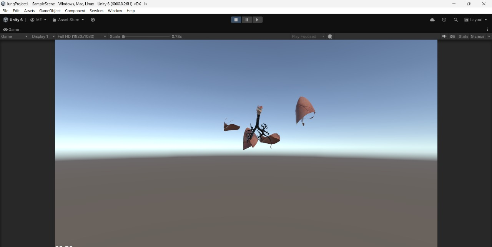
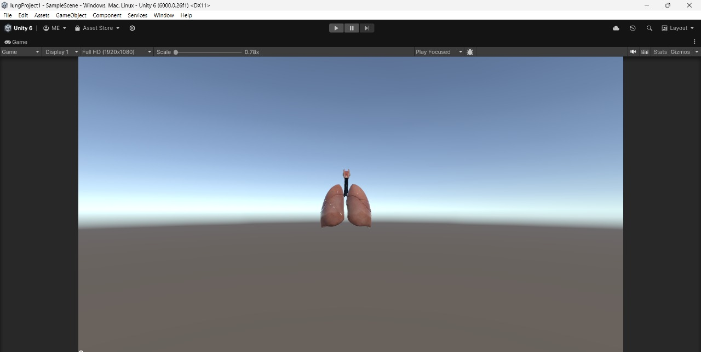

# Assembly-CSharp Project

This repository contains the `Assembly-CSharp` project configuration for a Unity-based 3D puzzle game. The game challenges players to assemble a 3D model of a lung, promoting both fun and educational engagement.

## Features

- **3D Puzzle Gameplay**: Assemble a detailed 3D lung model.
- **Educational Value**: Learn about lung anatomy while playing.
- **Unity Integration**: Built with the Unity engine for smooth and immersive gameplay.
- Configured for both `Debug` and `Release` build configurations.
- Supports the .NET 9.0 language version.

## Prerequisites

- [Unity](https://unity.com/) (compatible version for your project)
- [.NET SDK](https://dotnet.microsoft.com/) (ensure it supports the project language version)

## Setup

1. Clone this repository to your local machine:
   ```bash
   git clone <repository-url>
   ```

2. Open the project in Unity:
   - Launch Unity Hub.
   - Add the project directory.
   - Open the project in Unity.

3. Ensure all dependencies and assets are properly imported.

## Build and Run

1. Configure the build settings in Unity:
   - Navigate to **File > Build Settings**.
   - Choose the target platform.
   - Set the appropriate build configuration (`Debug` or `Release`).

2. Click **Build and Run** to generate the executable and start the application.

## Project Structure

- **Assembly-CSharp.csproj**: Configuration file for the Unity C# assembly.
- **Temp/**: Intermediate build outputs.
- **Assets/**: Project assets and scripts, including the lung model and puzzle logic.
- **Packages/**: Unity package dependencies.

## Images

Below are some visuals showcasing the gameplay and features:

- **Game Screenshot**: 
- **Lung Model Preview**: 


