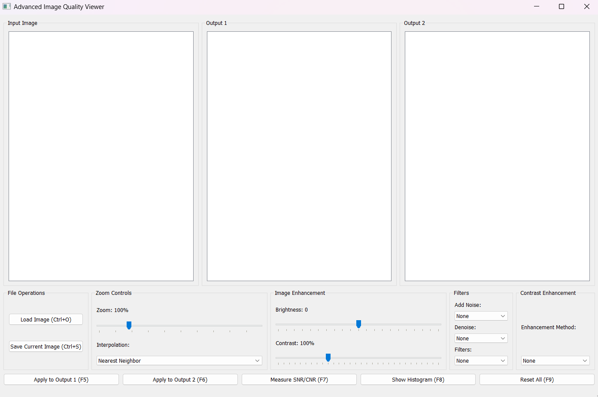
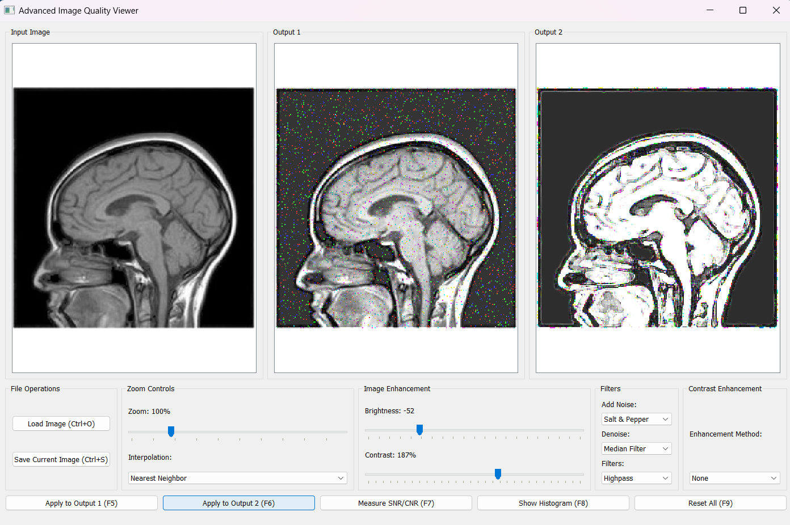
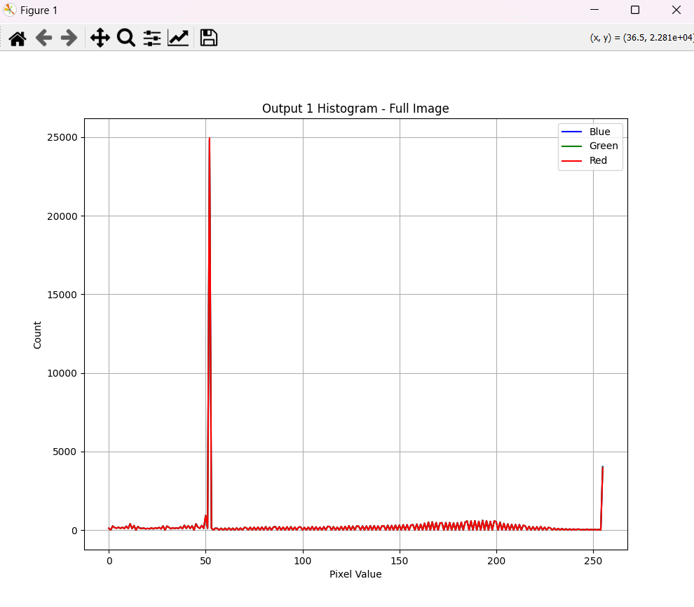

# Advanced Image Quality Viewer

The **Advanced Image Quality Viewer** is a Python-based application for image processing and enhancement. It features a graphical user interface (GUI) built with PyQt5, enabling users to load, view, and enhance images through various operations such as brightness adjustment, noise reduction, contrast enhancement, and more.

## Features

- **Image Loading and Saving**:
  - Open grayscale or color images in popular formats (e.g., PNG, JPG, BMP, TIFF).
  - Save processed images with a single click.

- **Zoom and Pan**:
  - Easily zoom in/out on images using sliders or mouse control.
  - Pan around images for detailed inspection.

- **Region of Interest (ROI) Selection**:
  - Select up to three ROIs for analysis or custom processing.
  - Measure SNR (Signal-to-Noise Ratio) and CNR (Contrast-to-Noise Ratio).

- **Image Enhancements**:
  - Adjust brightness and contrast with real-time previews.
  - Apply advanced contrast enhancement techniques such as Histogram Equalization, CLAHE, and custom stretching.

- **Filters and Noise Processing**:
  - Add various types of noise (e.g., Gaussian, Salt & Pepper).
  - Apply denoising filters (e.g., Median, Gaussian, Non-local Means).
  - Use frequency domain filters (e.g., Lowpass, Highpass).

- **Histogram Analysis**:
  - View histograms for entire images or selected ROIs.
  - Separate histograms for each color channel (RGB) in color images.

- **Keyboard Shortcuts**:
  - Access common operations like loading, saving, applying enhancements, and resetting settings with hotkeys.

## Requirements

To run the application, ensure you have the following dependencies installed:

- Python 3.7+
- PyQt5
- OpenCV
- Matplotlib
- NumPy

Install dependencies using pip:

```bash
pip install PyQt5 opencv-python matplotlib numpy
```

## Usage

1. Clone or download the repository.
2. Run the application:

   ```bash
   python PhotoQuality.py
   ```

3. Load an image using the "Load Image" button or by pressing `Ctrl+O`.
4. Apply desired enhancements or filters using the provided controls.
5. Save the processed image using the "Save Image" button or `Ctrl+S`.

## Interface Overview

### Main Layout

- **Input Image Panel**: Displays the loaded image.
- **Output Panels**: Two panels for displaying processed images.

### Controls

- **File Operations**: Buttons for loading and saving images.
- **Zoom Controls**: Adjust zoom level and choose interpolation method.
- **Enhancement Settings**: Sliders for brightness and contrast adjustments.
- **Filters**: Dropdown menus for adding noise, denoising, and applying frequency filters.
- **Contrast Enhancement**: Select methods like Histogram Equalization and CLAHE.

### Action Buttons

- Apply enhancements to Output 1 (`F5`) or Output 2 (`F6`).
- Measure SNR and CNR for selected ROIs (`F7`).
- Show histograms (`F8`).
- Reset all settings to defaults (`F9`).

## Screenshots

### Main Interface



### Image Enhancement Example



### Histogram Analysis




## File Structure

```plaintext
.
├── PhotoQuality.py        # Main application code
├── assets/                # Directory for storing screenshots
```

## License

This project is open-source and free to use or modify.

