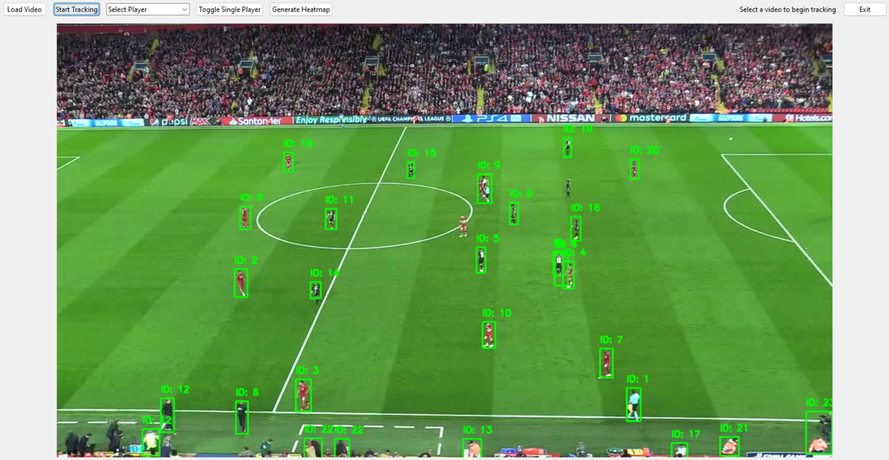

# Football Player Tracker

A GUI-based application for tracking football players using YOLOv5 and generating player-specific heatmaps. This application allows users to load a video, track players, and visualize their movements on a football field.

---

## Features

- **Player Detection and Tracking**: Tracks football players in a video using YOLOv5.
- **GUI Interface**: User-friendly interface built with Tkinter.
- **Heatmap Generation**: Visualizes player movement using heatmaps.
- **Zoomed View**: Focus on a specific player's movements.
- **Customizable**: Easily adaptable to other use cases with YOLOv5.

---

## Installation

### Requirements

Ensure you have the following dependencies installed:

- Python 3.7+
- `torch`
- `opencv-python`
- `numpy`
- `pillow`
- `matplotlib`
- `seaborn`
- `tkinter`
- `ultralytics`

### Setup

1. Clone the repository:

   ```bash
   git clone https://github.com/yourusername/football-tracker.git
   cd football-tracker
   ```

2. Install dependencies:

   ```bash
   pip install -r requirements.txt
   ```

3. Download YOLOv5 weights:

   This application uses YOLOv5. The weights (`yolov5s.pt`) should be downloaded automatically when the application runs for the first time.

---

## Usage

1. Run the application:

   ```bash
   python football_tracker.py
   ```

2. Load a video file by clicking the **Load Video** button.
3. Start tracking players using the **Start Tracking** button.
4. Select a player from the dropdown menu to view individual heatmaps or zoomed views.
5. Generate a movement heatmap by clicking the **Generate Heatmap** button.
6. Exit the application using the **Exit** button.

---

## How It Works

### Core Functionality

1. **Player Detection**:
   - The YOLOv5 model detects players in each frame of the video.

2. **Player Identification**:
   - Each detected player is assigned a unique ID.
   - The algorithm tracks player positions across frames.

3. **Heatmap Generation**:
   - Player movement data is stored and visualized using Seaborn's kernel density estimation (KDE).

4. **GUI**:
   - Built using Tkinter for cross-platform compatibility.
   - Allows users to control the tracking process and visualize results in real-time.

### Key Components

- **YOLOv5**: Detects players in video frames.
- **Tkinter**: Creates the GUI interface.
- **OpenCV**: Handles video processing and frame display.
- **Seaborn**: Generates heatmaps for player movements.

---

## Screenshots


*Main screen showing the video tracking interface.*





*Player movement heatmap.*


---

## Contributing

Contributions are welcome! Please fork the repository and submit a pull request with your changes.

### To Do:

- Add support for multiple sports.
- Improve player re-identification logic.
- Optimize GUI performance.

---

## License

This project is licensed under the MIT License. See the [LICENSE](LICENSE) file for details.

---

## Acknowledgments

- **YOLOv5**: [Ultralytics](https://github.com/ultralytics/yolov5)
- **Tkinter**: Python's built-in GUI toolkit.
- **OpenCV**: For powerful computer vision functionalities.
- **Seaborn**: For creating attractive heatmaps.

---

